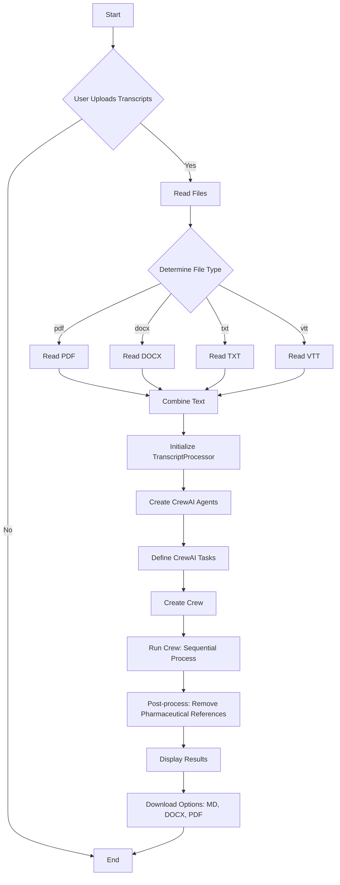

# Lecture Transcript Analysis Agent

This Streamlit application leverages the CrewAI framework and Google's Gemini model to process lecture transcripts and generate comprehensive, structured educational materials.  It takes raw lecture transcripts (in various formats) and outputs a well-organized document suitable for study, review, and assessment.

## Features

*   **Multiple File Format Support:** Accepts transcripts in `.txt`, `.pdf`, `.docx`, and `.vtt` formats.
*   **Automated Content Generation:**  Produces a structured document containing the following sections, in the specified order:
    *   Title and Speaker Information
    *   Key Quotes (20-25 impactful quotes)
    *   Closing Statements
    *   Briefing Document (Summary)
    *   Key Themes and Ideas
    *   Notable Quotes with Context
    *   FAQ Section (10 questions)
    *   Quiz Questions (10 questions)
    *   Quiz Answer Key
    *   Essay Questions (5-7 questions)
    *   Essay Answers
    *   Speaker Bio
*   **Pharmaceutical Company Reference Removal:**  Automatically detects and redacts mentions of pharmaceutical companies to maintain generality and avoid bias.  This is a crucial feature for creating broadly applicable educational content.
*   **Download Options:** Allows users to download the processed output in Markdown, Word (.docx), and PDF formats.
*   **Progress Tracking:**  Provides visual feedback on the processing status with a progress bar and status messages.
* **Session Reset:** Includes a reset button in the sidebar to clear the session state and start fresh.
* **Dynamic Filename Generation**: Incorporates the date, extracted from the input filename if available, into the output filenames. If no date is found, it uses the current date.
* **Preview and Raw Markdown:** Displays results in two tabs: one for a formatted preview and another showing the raw Markdown code.

## Installation and Setup

1.  **Clone the repository:**

    ```bash
    git clone <repository_url>
    cd <repository_directory>
    ```

2.  **Install dependencies:**

    ```bash
    pip install -r requirements.txt
    ```
    The `requirements.txt` file should contain (at least) the following:

    ```
    streamlit
    crewai
    python-docx
    pypdf2
    xhtml2pdf
    markdown2
    ```

3.  **Obtain a Google Gemini API Key:** You'll need an API key for Google's Gemini model.  You can get one from the Google Cloud Console.

4.  **Run the application:**

    ```bash
    streamlit run transcript_processor.py  # Replace transcript_processor.py with the actual filename
    ```

## Usage

1.  **Enter API Key:** Once the Streamlit application is running, enter your Gemini API key in the sidebar input field.
2.  **Enter Speaker Name:** Provide the name of the lecturer or speaker.
3.  **Upload Transcripts:** Upload one or more transcript files using the file uploader.  Supported formats are `.txt`, `.pdf`, `.docx`, and `.vtt`.
4.  **Process Transcripts:** Click the "Process Transcripts" button.  The application will display a progress bar and status messages while processing.
5.  **Download Results:** Once processing is complete, the processed document will be displayed.  You can download it in Markdown, Word, or PDF format using the provided buttons.
6. **Reset Session (Optional):** If you want to process new transcripts, click the "Reset Session" button in the sidebar to clear the previous results.

## Code Structure and Explanation

The code is organized into several key components:

*   **File Reading Functions:**  `read_pdf`, `read_docx`, `read_vtt`, `read_txt`, and `read_file` handle reading and extracting text from different file types.  The `read_file` function acts as a dispatcher, selecting the appropriate reading function based on the file extension.  These functions robustly handle both file paths (strings) and file-like objects (BytesIO), and seek to the beginning of file-like objects before processing.

*   **`TranscriptProcessor` Class:** This class encapsulates the core logic for processing transcripts using CrewAI.

    *   `__init__(self, api_key)`: Initializes the class with the Gemini API key and sets up the CrewAI agents.
    *   `setup_agents(self)`: Defines the three CrewAI agents:
        *   `content_analyzer`: Analyzes the transcript and extracts initial information (title, speaker, key quotes, closing statements).
        *   `quote_extractor`: Extracts key themes, creates a briefing document, and identifies notable quotes with context.
        *   `content_writer`:  Creates the final structured document, assembling all the sections in the required order. This agent has detailed instructions to handle the formatting and organization of the output.
    *   `process_transcript(self, transcript_text, speaker_name, progress_bar, status_text)`: This is the main method that orchestrates the transcript processing. It defines the CrewAI tasks, creates the `Crew`, and runs the process. It also includes:
        *   **Progress Updates:**  Updates the Streamlit progress bar and status text to provide feedback to the user.
        *   **Error Handling:**  Uses `try...except` blocks to catch and report errors during processing.
        *   **Pharmaceutical Reference Removal:** Post-processes the output to remove any remaining mentions of Pharmaceutical References
        *   **Detailed Task Descriptions:** Each task has a very specific `description` and `expected_output` to guide the LLM. This is crucial for achieving the desired results. The descriptions explicitly instruct the agents *not* to include any pharmaceutical company references.

*   **Markdown to PDF/DOCX Conversion:** The `markdown_to_pdf` and `markdown_to_docx` functions convert the generated Markdown output to PDF and Word documents, respectively, handling basic styling. They utilize `xhtml2pdf` (for PDF) and `python-docx` (for Word). The DOCX conversion includes specific styling rules for different text elements (titles, headers, quotes, lists, etc.) to ensure a well-formatted output document.

*   **Streamlit UI:** The Streamlit code provides the user interface, including input fields for the API key and speaker name, a file uploader, a process button, progress indicators, and download buttons for the output. It also includes error handling to display messages to the user if any issues occur. The use of `st.session_state` ensures that the processed result persists across reruns.

## Mermaid Diagrams

### Main Process Flow

### CrewAI Agent Interaction
```mermaid
    graph LR
        A1[Content Analyzer] --> B1(Initial Analysis)
        B1 --> C1[Quote Extractor]
        C1 --> D1(Themes and Briefing)
        D1 --> E1[Content Writer]
        E1 --> F1(Final Structured Document)
        A1 --> D1  
        B1 -.-> F1 
    end
```
### File Reading Logic
```mermaid
    graph TD
        A2[Input File] --> B2{Determine File Type}
        B2 -->|pdf| C2[read_pdf]
        B2 -->|docx| D2[read_docx]
        B2 -->|txt| E2[read_txt]
        B2 -->|vtt| F2[read_vtt]
        B2 -->|Other| G2[Error: Unsupported File Type]
        C2 --> H2[Extracted Text]
        D2 --> H2
        E2 --> H2
        F2 --> H2
    end
```
### Download Options
```mermaid
    graph TD
        A3[Processed Markdown] --> B3{Choose Download Format}
        B3 -->|Markdown| C3[Download .md]
        B3 -->|Word| D3[markdown_to_docx]
        D3 --> E3[Download .docx]
        B3 -->|PDF| F3[markdown_to_pdf]
        F3 --> G3[Download .pdf]
    end
```
### Session Reset
```mermaid
    graph TD
        A4[User Interacts] --> B4{Reset Button Clicked?}
        B4 -->|Yes| C4[Clear st.session_state.processed_result]
        C4 --> D4[st.rerun]
        B4 -->|No| E4[Continue with Existing Session]
    end
```
### Filename Generation
```mermaid
    graph TD
        A5[Uploaded Files] --> B5{Extract Date from Filename}
        B5 -->|Date Found| C5[Use Extracted Date]
        B5 -->|Date Not Found| D5[Use Current Date]
        C5 --> E5[Construct Filename: YYYY-MM-DD_Transcript_Analysis]
        D5 --> E5
        E5 --> F5[Download Buttons]
    end
```
